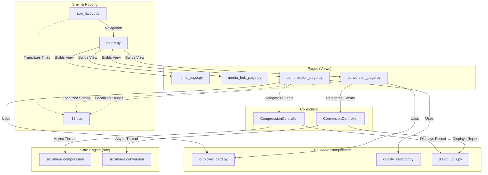
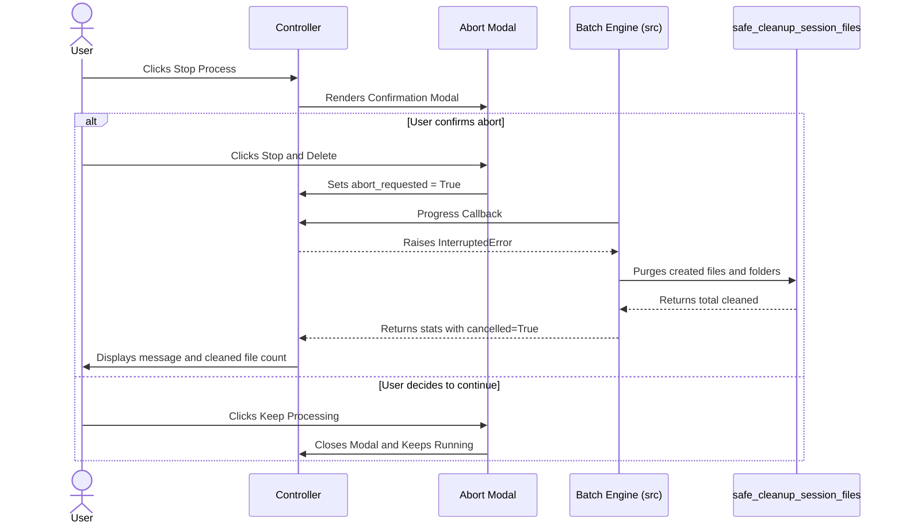
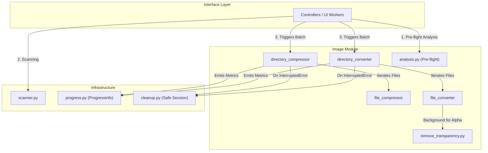
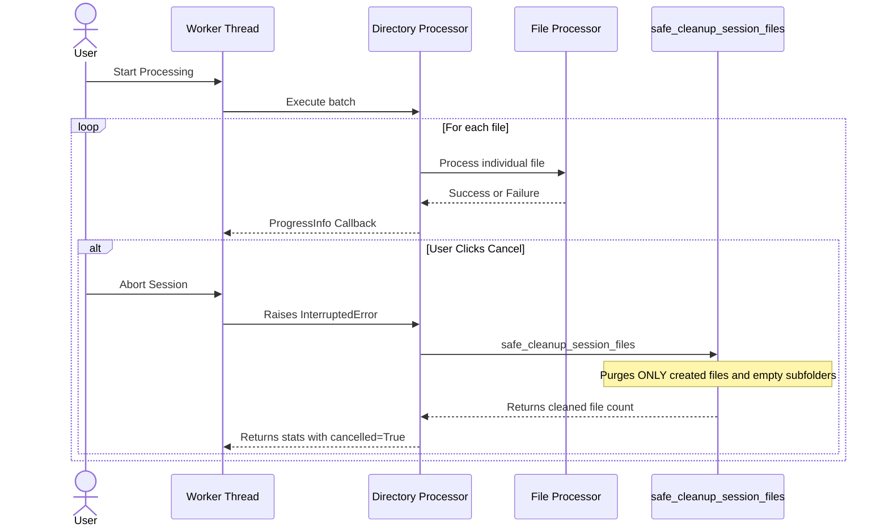

# Software Architecture — FallByte

## 1. Architecture Overview and Directory Tree

**FallByte** is a modular desktop application for high-performance media processing, conversion, and compression. The system adopts a strictly decoupled architecture following the **MVC / Reactive** pattern, completely separating the Graphical User Interface (UI) from business rules and file handling (Core Engine).

```text
FallByte/
├── ARCHITECTURE.md
├── LICENSE
├── README.md
├── main.py
├── requirements.txt
├── resources/              # Third-party binaries (FFmpeg) and static assets (icons)
│   ├── bin/
│   │   ├── linux/
│   │   ├── mac/
│   │   └── win/
│   └── icons/
│       └── logo.png
├── src/                    # Core Engine: Business logic and I/O processing
│   ├── image/
│   │   ├── compression/    # Compression engines and orchestrators
│   │   ├── conversion/     # Conversion engines and orchestrators
│   │   └── utils/          # Pre-flight analysis and transparency removal
│   ├── utils/              # Directory scanning, Progress metrics, and Safe cleanup
│   └── video/              # Engines for video module expansion
├── tests/                  # Unit and integration test suite
│   ├── image/
│   └── utils/
└── ui/                     # Reactive graphical user interface (Flet / Flutter for Python)
    ├── components/         # Encapsulated visual components
    ├── controllers/        # State controllers and asynchronous bridge
    ├── pages/              # Primary views/pages
    ├── utils/              # UI utilities and converter support
    ├── app_layout.py       # Global frame, Dynamic header, and Navigation stack
    ├── i18n.py             # Internationalization engine (i18n)
    ├── router.py           # Central screen mapper and router
    └── theme.py            # Design System (Colors, Typography, and Measurements)
```

---

## 2. User Interface Subsystem (`ui/`)

### A. UI Layer Overview

The `ui/` subsystem implements a reactive, event-driven, and decoupled architecture based on **Flet (Flutter for Python)**. The interface layer is exclusively responsible for the user experience, visual state management, route pre-validation, and asynchronous delegation of heavy I/O operations and media manipulation to the Core Engine (`src/`).

### B. UI Component Diagram and MVC Flow



### C. UI Architectural Patterns

1. **Historical Routing and Reactive Layout (`app_layout.py` & `router.py`):**
   * **Navigation Stack (`navigation_stack`):** Maintains the full history of visited routes to enable consistent "Back" navigation through the sticky header.
   * **Overlay Cleanup (`cleanup_page_overlays`):** Automatically purges open dialogs, pending popups, and `FilePicker` instances attached to `page.overlay` on every screen transition, preventing memory leaks and orphan control exceptions.
   * **Centralized Mapping:** The `ROUTE_REGISTRY` dictionary decouples navigation calls via string keys (e.g., `"image_hub"`, `"image_compression"`), binding them to their respective view builder functions.

2. **State Controllers (`controllers/`):**
   * **Concurrent Window Prevention (`picker_active`):** Controls the opening cycle of native OS pickers, blocking duplicate triggers on rapid double clicks.
   * **Pre-flight File Analysis:** Evaluates files within selected directories for incompatible extensions before invoking heavy processors, displaying informative `AlertDialog` popups.
   * **Dual Operation Mode:** Transparently evaluates whether the `selected_input` is a single file (`is_file()`) or a directory, triggering the corresponding APIs in `src/image/`.

### D. Sequence Diagram: UI Abort and Cancellation



### E. Design System and Componentization

* **QualitySelector (`quality_selector.py`):** Self-contained reactive component inheriting from `ft.Column`. Implements real-time bidirectional synchronization between a `Slider` (1-100) control and a `TextField` with focus-loss validation (`on_blur`).
* **IOPickerCard (`io_picker_card.py`):** Encapsulates responsive cards with ink ripple effects for click visual feedback and clean display of the selected directory/file path.
* **DialogUtils (`dialog_utils.py`):** Manages the post-execution summary modal (`show_summary_dialog`), computing overall space reduction statistics (original vs reduced bytes), success/failure counts, and expandable log details with contextual color support.
* **Global Theme (`theme.py`):** Centralizes design tokens maintaining visual consistency (`COLOR_CARD_BG`, `COLOR_PRIMARY`, `COLOR_SUCCESS`, `COLOR_ERROR`, `FORM_WIDTH = 420px`).

---

## 3. Core Engine (`src/`)

### A. Core Layer Overview

The `src/` directory concentrates business logic, low-level image handlers, and system utilities for **FallByte**. It was designed under the **Single Responsibility Principle (SRP)** and **Total UI Decoupling**, allowing any orchestrator (GUI, CLI, or Tests) to execute processing routines synchronously or asynchronously.

```text
src/
├── image/
│   ├── compression/        # Compression engines and orchestrators
│   ├── conversion/         # Conversion engines and orchestrators
│   └── utils/              # Pre-flight analysis and opacity handling
└── utils/                  # Infrastructure: Scanning, Progress, and Cleanup
```

### B. Core Component Diagram (`src`)



### C. Sequence Diagram: Batch Execution and Safe Cancellation



### D. Business Rules and Media Handling

#### Conversion Module (`src/image/conversion/`)
* **Purpose:** Standardize files to a single target format.
* **Alpha Channel / Transparency:** When the target format does not support opacity (e.g., `JPEG`, `BMP`), the `remove_transparency()` function flattens the image over a solid background color chosen by the user (`background_color`, default `#FFFFFF`).
* **ICO Format Handling:** Forces the dimension limit required by the Windows Icon format (256x256 pixels max) using the `LANCZOS` resampling algorithm.

#### Compression Module (`src/image/compression/`)
* **Purpose:** Reduce byte size while **strictly preserving the original format** of each file.
* **Defensive Rejection:** If an image contains transparency (`RGBA`/`LA` channels or `P` mode with `transparency` key) but the original format does not support Alpha, compression is skipped (`return False`), prompting the user to use the Conversion module instead.
* **PNG Quantization (TinyPNG style):** For `PNG` images with quality < 90, palette reduction is applied down to 256 colors via `FASTOCTREE` (with Alpha) or `MEDIANCUT` (without Alpha).

### E. I/O Isolation Guarantee (`safe_cleanup_session_files`)

The cleanup utility guarantees that mid-process cancellations **never result in the corruption of pre-existing data**:

1. **Restricted Scope:** Only instances present in `created_destination_files` are targeted for deletion.
2. **Root Protection:** The check `dst_file.parent != root_output_dir` prevents the root output directory selected by the user from being deleted.
3. **Clean Recursive Cleanup:** Only subdirectories created in the current session that remain completely empty after file removal are deleted.

---

## 4. Additional Resources and Testing (`resources/` & `tests/`)

### A. Assets and Binaries (`resources/`)
* **`resources/bin/`:** Stores pre-compiled platform binaries (Linux, macOS, Windows) for external tools such as `FFmpeg`, used by the video module without requiring a global system installation.
* **`resources/icons/`:** Contains static visual assets for the application (such as `logo.png`).

### B. Code Quality and Test Suite (`tests/`)
* **Structural Parity:** The test directory closely mirrors the `src/` tree (`tests/image/`, `tests/utils/`).
* **Side-Effect Isolation:** Executes automated suites via `pytest` for rigorous validation of conversion ratios, metadata preservation, failure cleanup logic, and pre-flight checks.